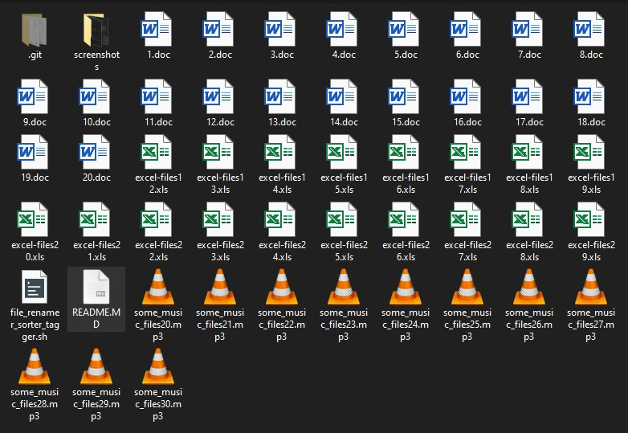

# File Sorter, Renamer, Tagger - A Bash Script

This is a script I wrote in order for me to organize my files of various file extensions by using their creation timestamp This is also a simple, yet practical exercise to advance my bash scripting skills. Feel free to fork, improve, comment, and suggest on how I can improve this script.

# The Bash Script Code:

Seen from Visual Code:

# Test Files:

Creating Test Files on CLI Cmder

Test Files Seen from Windows 10

# Running the Script:

After running the script, we see the results:

## 	CLI Cmder

## 	GUI - Windows 10

